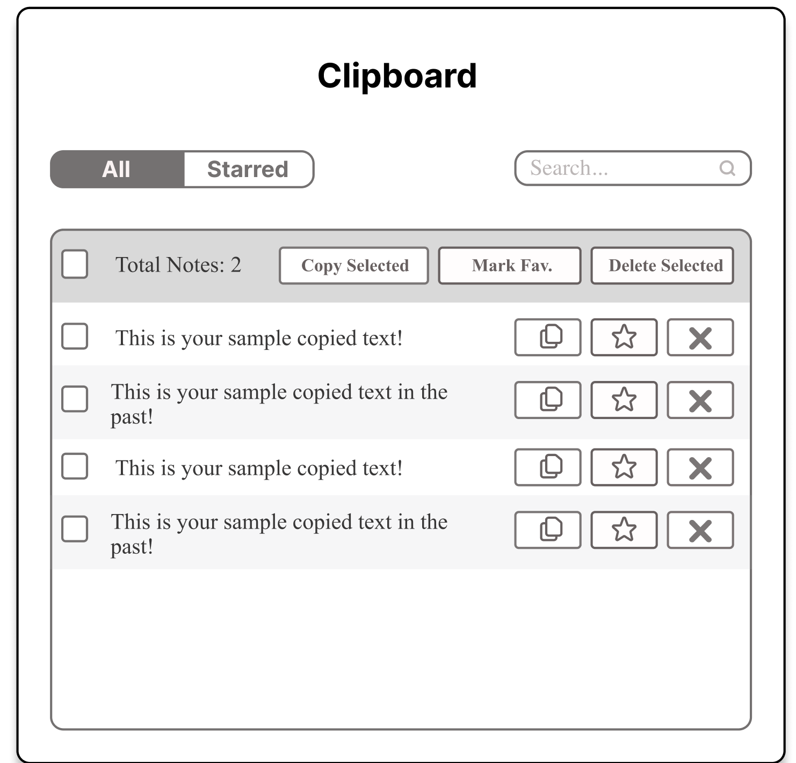
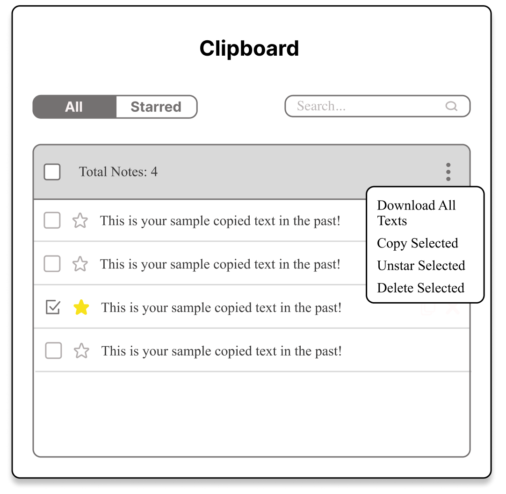
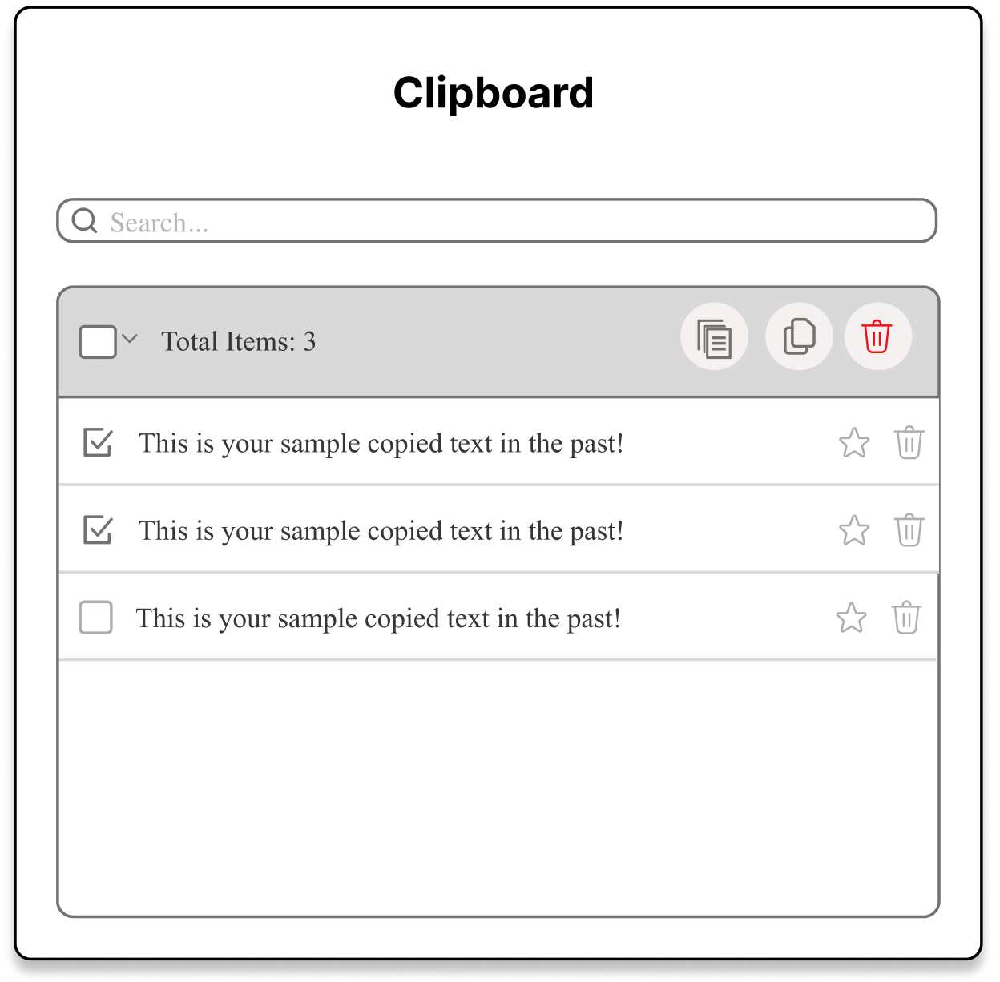

# PART 1: WEBSITE DESCRIPTION
This is a Chrome browser extension called Clipboard.
When I am working, I often copy one text and then copy another and realize that I have lost the first copy. Such an event inspires this solution. This extension helps people keep track of their copied text. It can be used by anyone who wants to remember multiple texts that they copy, unlike the latest one remembered by our browser currently. The extension will keep adding the copied text by the user in a table that the user can refer to whenever they want and use the data in the table in the manner they want.

The extension displays the copied text in a tabular format with the latest copied note on the top. At the top, the user can see a Search bar to search for a particular text they might have copied some time back. This feature allows for easy retrieval. The user could copy the previous texts, clear them from the queue, or mark them as favorites. Whenever they delete a note, they get an option to undo their action within seconds. They can also select multiple texts, merge them, copy them all, or delete them.

The header has an animation to keep the website fun and exciting. Whenever the user marks a text as a favorite, there is a party animation to make the extension more engaging.

There are also help texts that help users understand the extension's flow and provide guidance if needed. Similarly, there are confirmation messages whenever the user copies or deletes a text.

The website is also 100% accessible by keyboard. A keyboard-only user can navigate through the extension easily, access all the features, and see the helpful tips on hover for mouse users.

# PART 2: INTERACTIONS 
Below are the interaction types implemented -
- Search Input: There is a search bar on top. As you enter a text, the below table content is filtered based on the input.
- Checkboxes: There is a select-all checkbox and individual checkboxes for all rows. If you select any checkbox, options are displayed on the table header.
- Merge-All Icon: If you select multiple rows, the first icon displayed on the table header is the Merge All Icon. If you click on it, it will merge the selected rows.
- Copy-All Icon: If you select multiple rows, the second icon displayed on the table header is the Copy All Icon. If you click on it, it will copy the content of the selected rows with space in between.
- Delete-All Icon: If you select multiple rows, the last icon displayed on the table header is the Delete All Icon. If you click on it, it will delete the selected rows. Upon deletion, there will be a message below indicating the number of rows deleted and an Undo option that can undo the action.
- Star Icon: It is displayed on each row, and it marks the row as a favorite. A small party-type animation appears when a row is marked favorite.
- Delete Icon: It is displayed on each row and deletes a particular row. Upon deletion, there will be a message below indicating the number of rows deleted and an Undo option that can undo the action.
- Text truncation: If the text is too long, it is truncated by default, and only the first half is displayed. If the user hovers over the row, the row broadens to show the entire content.

# PART 3: EXTERNAL TOOLS
Below tools used:
- React Icons Library: All the icons displayed on the webpage are through this react library. I chose it to maintain consistency in the icons and make the website look nice. The user understands these icons, so extra text is not required.
- Animations: There are 2 places where animations are added - one to the header and one when a text is made favorite. I wrote the CSS to make things animate. It adds an element of fun and interactivity to the website.
- SASS: I used SASS instead of plain CSS since it allows more capabilities, makes the code look cleaner and more understandable, and allows for nested rules and mixins.
- Accessibility: The website is 100% keyboard accessible. Since it is an extension, people might want to interact with it with a keyboard. I used "tab index", "enter events", "onFocus", "onBlur" events, etc to make it keyboard-accessible.
- ESLINT: I downloaded the eslint library to understand more about how rules work and how we can manipulate them and make our code better.

# PART 4: ITERATIONS
I went through many iterations before the final design. The first iteration had tabs of All and Favorites on Top, and the header had different icons. It also had a separate copy button for each row. The next iteration replaced the icons with the Actions menu and allowed the user to copy the row just by clicking on it. All main actions were shifted to the top menu. After further testing, the final design had only a search bar at the top. Favorites and delete were present for each row on the right side, and only required functions were converted into icons and present in the header icon.

# PART 5: CHALLENGES
I faced a couple of challenges -
- It took a great amount of effort to understand how to listen to chrome runtime copy events into the Clipboard
- It also took some time to understand how to implement keyboard accessibility.
- Animations were also a learning since it took time to implement them from scratch and understand how things move. 